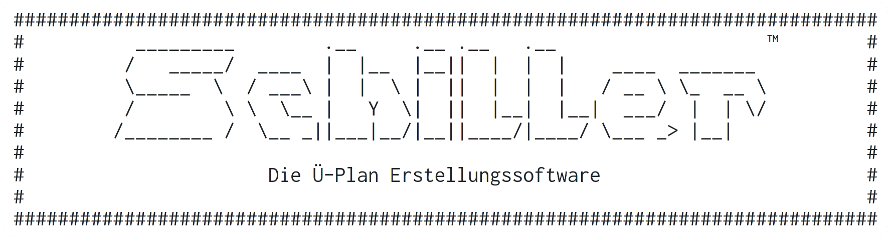
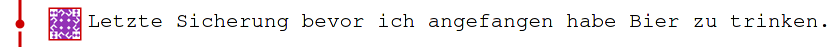
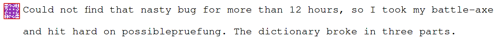
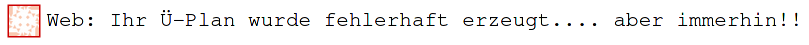

# Schiller Online


[](https://github.com/Oberschule-an-der-Egge/schiller-online/actions)
[](/tests)

Web-Oberfläche zur Erstellung von Übersichtsplänen für die Kurswahl in der Oberstufe.

## Mitmachen
Wir freuen uns über jeden, der sich an der Entwicklung von Schiller-Online beteiligen möchte!

### Wie kann ich helfen?
Wer Fehler im Programm findet, kann diese unter [Issues](https://github.com/Oberschule-an-der-Egge/schiller-online/issues)
beschreiben. Fehlersuche und das Reproduzieren von Fehlern ist sehr zeitaufwändig und jeder Hinweis ist sehr hilfreich,
an dieser Stelle schon einmal einen herzlichen Dank!

Wer am Programmcode arbeiten möchte, folgt diesen Schritten:
* Eine eigenen [Kopie (Fork) des Repositories](https://github.com/Oberschule-an-der-Egge/schiller-online/fork) auf github erstellen
* Diesen Fork mit `git clone` lokal herunterladen und einrichten (s.u.: "Sofort loslegen")
* Mit `git switch -c new-feature-branch` einen eigenen Branch erstellen, in dem man Änderung vornimmt
* Diese Änderungen mit einem [Pull Request](https://github.com/Oberschule-an-der-Egge/schiller-online/pulls) von `new-feature-branch -> main` vorschlagen

Dieses Vorgehen ist als [Github Flow](https://guides.github.com/introduction/flow/) bekannt.
Sollten Probleme auftauchen, lege gerne eine neue Issue an, wir werden versuchen dich zu unterstützen!

### Sofort Loslegen

```shell
git clone https://github.com/Oberschule-an-der-Egge/schiller-online.git
cd schiller-online
python -m venv venv
source venv/bin/activate
pip install -r requirements.txt
```

* [Redis](https://redis.io) lokal installieren und mit `redis-server` ausführen. Es sollte keine weitere Konfiguration nötig sein.
* Die Umgebungsvariable `FLASK_ENV=development` setzen, z.B. hier für [PyCharm](docs/supporting/pycharm-flaskenv.png)
* Die aktuellen Sessiondaten können unter `/redis` eingesehen werden.

### Tech Stack
Schiller-Online läuft mit Python, HTML, CSS und ein bisschen Javascript zur Darstellung der Formulare.
Die Applikation wird über das Webframework [Flask](https://flask.palletsprojects.com) gesteuert.
Daten, die während der Ausführung erzeugt werden, werden in [Redis](https://redis.io) gespeichert.
Die automatischen Tests werden mit [Pytest](https://pytest.org) ausgeführt.

Unter [docs/redis.md](docs/redis.md) findet sich eine genaue Beschreibung, wie Schiller-Online Redis einsetzt,
wer sich für Pytest interessiert findet Details unter [docs/testing.md](docs/testing.md).

### Lizenz
Wenn man die Zeit aufwendet, um Code für eine Open-Source Applikation zu schreiben, möchte man sichergehen, dass dieser
nicht missbraucht und entgegen der eigenen Vorstellung verwendet wird.

Die App ist deswegen unter der [Open-Source-Linzenz für die Europäische Union](LICENSE) lizensiert.
Dies soll sicherstellen, dass alle Helfer die Rechte an ihrer Arbeit behalten, dass diese Arbeit aber nicht in
proprietärer Software landet und dass sie persönlich nicht haftbar gemacht werden können.

Noch wichtiger jedoch ist der Gedanke, dass jeder, der diese Software verwenden möchte, seinen Quellcode öffentlich
machen und unter eine Copyleft Lizenz stellen muss. Dies stellt im Idealfall sicher, dass Verbesserungen an der Software
allen zugutekommen und jeder die Möglichkeit bekommt, die Software zu verändern.

## Roadmap
- [x] Testing: Mock Flask + Session Cookies, Mock Redis
- [x] Test Coverage erhöhen
- [x] Ausgabe als Excel-Spreadsheet (vorher nur HTML->PDF)
- [x] Mailing
- [ ] `.env` für Konfiguration verwenden
- [ ] Flask WTF für Formulare
- [ ] Possible Future-Refactor: Ein Raster-Objekt das nach Redis de/serialisiert wird; übersichtlicher (try msgpack)

## Aufbau des Repository

* [`docs/`](docs/) - Dokumentation und Bilder
* [`output/`](output/) - Test-Output (z.B. pdf, xlsx) während der Entwicklung
* [`src/`](src/) - Programmcode
  * [`config/`](src/config/) - Konfiguration je nach `FLASK_ENV` Umgebungsvariable
  * [`models/`](src/models/) - Struktur der App-Daten
  * [`services/`](src/services/) - Code für z.B. Interaktion mit der Datenbank, Mailing, ...
  * [`static/`](src/static/) - Statische Dateien, z.B. `css` `js` `png`
  * [`templates/`](src/templates/) - Jinja2 Templates zur Darstellung der `html`-Seiten
  * [`views/`](src/views/) - Applikationslogik, `routes.py` steuert die einzelnen Abfragen in `process/`
  * [`main.py`](src/main.py) - 2. Entry Point, Flask-Applikation
* [`tests/`](tests/) - Automatisierte Tests, werden mit `pytest` ausgeführt
  * [`functional/`](tests/functional/) - Tests der gesamten Applikation
  * [`unit/`](tests/unit/) - Tests für einzelne Funktionen
  * [`conftest.py`](tests/conftest.py) - Konfigurationsdatei für `pytest`
* [`.github/`](.github/) - Konfiguration für github Actions (automatische Tests/CI)
* [`wsgi.py`](wsgi.py) - 1. Entry Point, Applikations-Server

## Historisches
Entstanden am 12.03.2020 an der Oberschule an der Egge, ursprünglich als CLI-Applikation.
Namenspate war die Schulleitungslegende Ingo Schiller, selbst kein Technikfreund - aber präzise, wenn es ums Detail ging.
Diese Genauigkeit und die Freude am Gerät sind seit Beginn unser Antrieb:







Konzept & CLI Code [@dertopher](https://github.com/dertopher)  
Web Code [@cmacht](https://github.com/cmacht)
